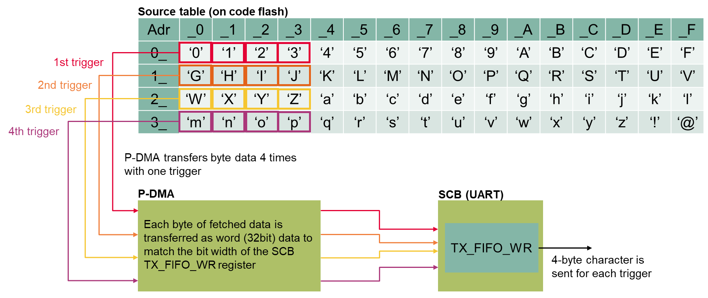
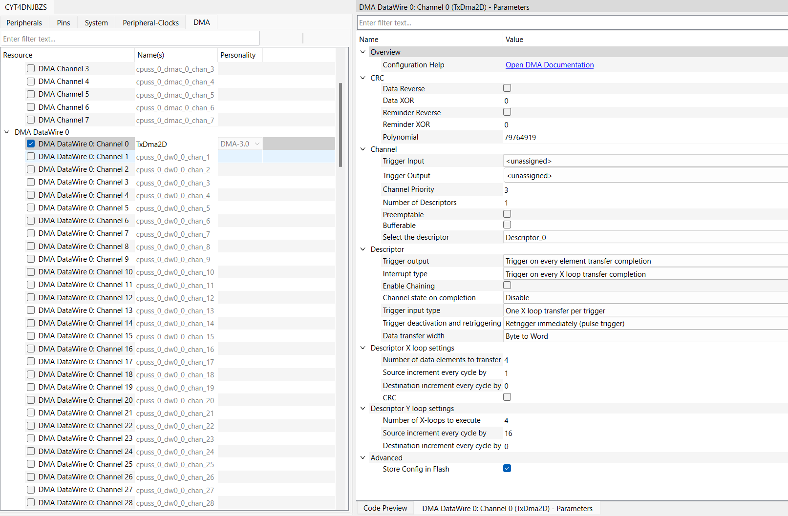
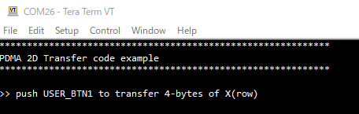
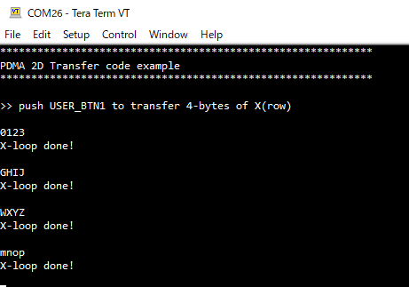

# P-DMA 2D Transfer

**This code example demonstrates the transmission of data by Peripheral Direct Memory Access (P-DMA) 2D Transfer, shows its operation, initial setting, and interrupt handling.**

## Device
The device used in this code example (CE) is:
- [TRAVEO™ T2G CYT4DN Series](https://www.infineon.com/cms/en/product/microcontroller/32-bit-traveo-t2g-arm-cortex-microcontroller/32-bit-traveo-t2g-arm-cortex-for-cluster/traveo-t2g-cyt4dn/)

## Board
The board used for testing is:
- TRAVEO&trade; T2G Cluster 6M Lite Kit ([KIT_T2G_C-2D-6M_LITE](https://www.infineon.com/cms/en/product/evaluation-boards/kit_t2g_c-2d-6m_lite/))

## Scope of work

This code example demonstrates the transmission of data by P-DMA with 2D-Transfer.

## Introduction

**P-DMA**

The TRAVEO™ T2G device supports two kinds of DMA controllers: Peripheral DMA (P-DMA) and Memory DMA (M-DMA). The main difference between the M-DMA and P-DMA controllers is that the M-DMA controller has dedicated channel logic (with channel state) for each channel, whereas the P-DMA reuses the channel logic for all channels.
<table border="1" style="border-collapse: collapse">
<thead><tr>
<th>Feature</th><th>P-DMA</th><th>M-DMA</th></tr></thead>
<tbody>
<tr><td><code>Focus</code></td><td>Low latency</td><td>High memory bandwidth</td></tr>
<tr><td><code>Used for</code></td><td>Transfer between peripheral and memory</td><td>Transfer between memories</td></tr>
<tr><td><code>Transfer engine</code></td><td>Shared between all channels</td><td>Dedicated for each channel</td></tr>
<tr><td><code>Transfer size</code></td><td colspan="2">8-bit/16-bit/32-bit</td></tr>
<tr><td><code>Channel priority</code></td><td>Four levels, Preemptable</td><td>Four levels</td></tr>
<tr><td><code>Transfer mode</code></td><td>Single 1D/2D CRC transfer</td><td>Single 1D/2D Memory copy Scatter</td></tr>
<tr><td><code>Descriptor</code></td><td colspan="2">Source and destination address Transfer size Channel action Data transfer mode Activation trigger type (4 types) Output trigger type (4 types) Interrupt type (4 types) Descriptor chaining</td></tr>
<tr><td><code>Access-control attributes</code> <i>The access attributes of the bus transfer that programmed the channel will be inherited</i></td><td colspan="2">Privileged/Unprivileged Secure/Non-secure Protection contexts</td></tr>
</tbody>
</table>

The P-DMA controller is part of the CPUSS and controls data transfer between peripherals and memory. This controller can be configured/programmed to perform multiple independent data transfers. Each data transfer is managed by a channel. The Descriptor type are Single transfer, 1D/2D transfer and CRC transfer.

**UART included in Serial Communication Block (SCB)**

- Supports UART protocol
  - Standard UART
  - Multi-processor mode
- SmartCard (ISO7816) reader
- IrDA
- Supports LIN
  - Break detection
  - Baud rate detection
  - Collision detection (ability to detect that a driven bit value is not reflected on the bus, indicating that another component is driving the same bus)
- Data frame size programmable from 4 to 16 bits
- Programmable number of STOP bits, which can be set in terms of half bit periods between 1 and 4
- Parity support (odd and even parity)
- Median filter on RX input
- Programmable oversampling
- Start skipping
- FIFO mode operation only
- Local loop-back control

More details can be found in:
- TRAVEO&trade; T2G CYT4DN
  - [Technical Reference Manual (TRM)](https://www.infineon.com/dgdl/?fileId=8ac78c8c8691902101869f03007d2d87)
  - [Registers TRM](https://www.infineon.com/dgdl/?fileId=8ac78c8c8691902101869ef098052d79)
  - [Data Sheet](https://www.infineon.com/dgdl/?fileId=8ac78c8c869190210186f0cceff43fd0)

## Hardware setup

This CE has been developed for:
- TRAVEO&trade; T2G Cluster 6M Lite Kit ([KIT_T2G_C-2D-6M_LITE](https://www.infineon.com/cms/en/product/evaluation-boards/kit_t2g_c-2d-6m_lite/)) 

**Figure 1. KIT_T2G_C-2D-6M_LITE (Top View)**

 

## Implementation

This design consists of P-DMA, a User Button1. The P-DMA is set to initiate transfers by software triggers. Pressing the user button generates an interrupt. When interrupt occurs, P-DMA transfer is triggered by software. Then, P-DMA transfers data from a source address to a destination address.

The transmitted data are composed of 64 unique values on code flash memory, and transferred to UART TX FIFO using 2D transfer in single descriptor. The terminal software connected to KitProg3 COM port will print out the data transferred. The 2D transfer is configured as figure below:
 
This 2D transfer is configured as do X-loop four times by one trigger, and Y-loop is configured as perform four times as well. In X-loop, P-DMA fetches one-byte data from source table and expands it to 32bit data then transfers it to TX_FIFO_WR register of SCB.

**P-DMA configuration**

The P-DMA initialization is done in following steps.

- To initialize DMA Descriptor, <a href="https://infineon.github.io/mtb-pdl-cat1/pdl_api_reference_manual/html/group__group__dma__descriptor__functions.html#gab1610fab6f2dd5fd25c031ac0aa9d8cb"><i>Cy_DMA_Descriptor_Init()</i></a> is called with using structure <a href="https://infineon.github.io/mtb-pdl-cat1/pdl_api_reference_manual/html/structcy__stc__dma__descriptor__config__t.html"><i>cy_stc_dma_descriptor_config_t</i></a> and <a href="https://infineon.github.io/mtb-pdl-cat1/pdl_api_reference_manual/html/structcy__stc__dma__descriptor__t.html"><i>cy_stc_dma_descriptor_t</i></a> which are auto-coded by Device Configurator as argument.

- To initialize P-DMA channel, <a href="https://infineon.github.io/mtb-pdl-cat1/pdl_api_reference_manual/html/group__group__dma__channel__functions.html#gab0beed3c05362206ac66fc4327d8964b"><i>Cy_DMA_Channel_Init()</i></a> is called with using structure <a href="https://infineon.github.io/mtb-pdl-cat1/pdl_api_reference_manual/html/structcy__stc__dma__channel__config__t.html"><i>cy_stc_dma_channel_config_t</i></a> which are auto-coded by Device Configurator as argument.

  **Figure 2. P-DMA setting** 

- Source and destination addresses are specified by <a href="https://infineon.github.io/mtb-pdl-cat1/pdl_api_reference_manual/html/group__group__dma__descriptor__functions.html#ga2df838cf16522aa18ad713fd05107b4c"><i>Cy_DMA_Descriptor_SetSrcAddress()</i></a> and <a href="https://infineon.github.io/mtb-pdl-cat1/pdl_api_reference_manual/html/group__group__dma__descriptor__functions.html#ga2c7111653150314961db83f7941a03c2"><i>Cy_DMA_Descriptor_SetDstAddress()</i></a> respectively.

- To sets a descriptor as current for the specified P-DMA channel, <a href="https://infineon.github.io/mtb-pdl-cat1/pdl_api_reference_manual/html/group__group__dma__channel__functions.html#ga4c5cca40de761c4b7827ce65538bf12d"><i>Cy_DMA_Channel_SetDescriptor()</i></a> is called with using structure <a href="https://infineon.github.io/mtb-pdl-cat1/pdl_api_reference_manual/html/structcy__stc__dma__descriptor__t.html"><i>cy_stc_dma_descriptor_t</i></a> which are auto-coded by Device Configurator as argument.

- To make an interrupt when the data transfer is completed, <a href="https://infineon.github.io/mtb-pdl-cat1/pdl_api_reference_manual/html/group__group__dma__channel__functions.html#gab3e0528d8e57ee04dbbee89ffca38545"><i>Cy_DMA_Channel_SetInterruptMask()</i></a> is called and the interrupt service routine is registered by <a href="https://infineon.github.io/mtb-pdl-cat1/pdl_api_reference_manual/html/group__group__sysint__functions.html#gab2ff6820a898e9af3f780000054eea5d"><i>Cy_SysInt_Init()</i></a> and enabled by *NVIC_EnableIRQ()*.

- After that enable P-DMA by <a href="https://infineon.github.io/mtb-pdl-cat1/pdl_api_reference_manual/html/group__group__dma__channel__functions.html#ga13e6923cafe660ba825ba6d5b1841bf7"><i>Cy_DMA_Channel_Enable()</i></a> and <a href="https://infineon.github.io/mtb-pdl-cat1/pdl_api_reference_manual/html/group__group__dma__block__functions.html#gad14b53935dc8321f395e49a7dfec2c5a"><i>Cy_DMA_Enable()</i></a>.

**UART control**

The UART is initialized by the PDL function <a href="https://infineon.github.io/mtb-pdl-cat1/pdl_api_reference_manual/html/group__group__scb__uart__general__functions.html#gacbc061f623d2fafbcfffcb58c5f2db51"><i>Cy_SCB_UART_Init()</i></a>.
  - The pin is specified to use KitProg3 COM port
  - The serial port parameters become to 8N1 and 115200 baud

Then call <a href="https://infineon.github.io/mtb-pdl-cat1/pdl_api_reference_manual/html/group__group__scb__uart__general__functions.html#ga503d0737dadf35620306ef3571d84905"><i>Cy_SCB_UART_Enable()</i></a> to enable the UART channel.

To output some guidance of this CE to the terminal, <a href="https://infineon.github.io/mtb-pdl-cat1/pdl_api_reference_manual/html/group__group__scb__uart__low__level__functions.html#ga4092c34575a47087e08a58529451914b"><i>Cy_SCB_UART_PutString()</i></a> is called respectively.

**GPIO port pin initialization**

Initialization of the GPIO port pin is done in the <a href="https://infineon.github.io/mtb-pdl-cat1/pdl_api_reference_manual/html/group__group__gpio__functions__init.html#gad61553f65d4e6bd827eb6464a7913461"><i>Cy_GPIO_Pin_Init()</i></a> function.

- Initialize the pin specified by *User Button1* as input
- For the port of *User Button1*, configuration of the GPIO interrupt is done once in the <a href="https://infineon.github.io/mtb-pdl-cat1/pdl_api_reference_manual/html/group__group__sysint__functions.html#gab2ff6820a898e9af3f780000054eea5d"><i>Cy_SysInt_Init()</i></a> function.

**P-DMA Transfer**

- When pressing the user button is detected, the *handle_GPIO_Interrupt_SW1()* is called and set the *g_isInterrupt_SW1*.

- Next, input a software trigger to P-DMA by calling <a href="https://infineon.github.io/mtb-pdl-cat1/pdl_api_reference_manual/html/group__group__trigmux.html#ga882218319ecd105dede8b382e9a1c4a4"><i>Cy_TrigMux_SwTrigger()</i></a>. P-DMA performs a transfer for each trigger input, as a result 4 bytes from the source table are output to the terminal.

- *handle_PDMA_Interrupt()* is called when the transfer of each X-loop completion.
  - This handler firstly clears the interrupt by calling <a href="https://infineon.github.io/mtb-pdl-cat1/pdl_api_reference_manual/html/group__group__dma__channel__functions.html#ga9c5df2a8d891163cc1cc996e7d76c967"><i>Cy_DMA_Channel_ClearInterrupt()</i></a>.
  - To check the interrupt reason, <a href="https://infineon.github.io/mtb-pdl-cat1/pdl_api_reference_manual/html/group__group__dma__channel__functions.html#ga6ef61cb63dafd8b822dea5f2e6995614"><i>Cy_DMA_Channel_GetStatus()</i></a> is called.
    - If the reason is *CY_DMA_INTR_CAUSE_COMPLETION*, display a message to the terminal.

## Compiling and programming
Before testing this code example:  
- Power the board through the dedicated power connector 
- Connect the board to the PC through the USB interface
- Build the project using the dedicated Build button  or by right-clicking the project name and selecting "Build Project"
- To program the board, in the **Quick Panel**, scroll down, and click **[Project Name] Program (KitProg3_MiniProg4)**

## Run and Test

For this CE, a terminal emulator is required for displaying outputs. Install a terminal emulator if you do not have one. Instructions in this document use [Tera Term](https://teratermproject.github.io/index-en.html).

After code compilation, perform the following steps to flashing the device:

1. Connect the board to your PC using the provided USB cable through the KitProg3 USB connector.
2. Open a terminal program and select the KitProg3 COM port. Set the serial port parameters to 8N1 and 115200 baud.
3. Program the board using one of the following:
    - Select the CE project in the Project Explorer.
    - In the **Quick Panel**, scroll down, and click **[Project Name] Program (KitProg3_MiniProg4)**.
4. After programming, the CE starts automatically.
    - Confirm that the messages are displayed on the UART terminal.

      **Figure 3. Terminal output on program startup**  
      **Figure 4. Print out the result after press User Button1**  

5. You can debug the example to step through the code. In the IDE, use the **[Project Name] Debug (KitProg3_MiniProg4)** configuration in the **Quick Panel**. For details, see the "Program and debug" section in the [Eclipse IDE for ModusToolbox™ software user guide](https://www.infineon.com/dgdl/?fileId=8ac78c8c8929aa4d0189bd07dd6113f9).

**Note:** **(Only while debugging)** On the CM7 CPU, some code in *main()* may execute before the debugger halts at the beginning of *main()*. This means that some code executes twice: once before the debugger stops execution, and again after the debugger resets the program counter to the beginning of *main()*. See [KBA231071](https://community.infineon.com/t5/Knowledge-Base-Articles/PSoC-6-MCU-Code-in-main-executes-before-the-debugger-halts-at-the-first-line-of/ta-p/253856) to learn about this and for the workaround.

## References

Relevant Application notes are:
- [AN235305](https://www.infineon.com/dgdl/?fileId=8ac78c8c8b6555fe018c1fddd8a72801) - Getting started with TRAVEO&trade; T2G family MCUs in ModusToolbox&trade;
- [AN220191](https://www.infineon.com/dgdl/?fileId=8ac78c8c7cdc391c017d0d3aee0b678a) - How To Use Direct Memory Access (DMA) Controller In TRAVEO™ T2G FAMILY
- [AN225401](https://www.infineon.com/dgdl/?fileId=8ac78c8c7cdc391c017d0d3e657867d2) - How to Use Serial Communications Block (SCB) in Traveo II Family
- [AN219842](https://www.infineon.com/dgdl/?fileId=8ac78c8c7cdc391c017d0d3a490a6732) - How to use interrupt in TRAVEO™ II

ModusToolbox&trade; is available online:
- <https://www.infineon.com/modustoolbox>

Associated TRAVEO&trade; T2G MCUs can be found on:
- <https://www.infineon.com/cms/en/product/microcontroller/32-bit-traveo-t2g-arm-cortex-microcontroller/>

More code examples can be found on the GIT repository:
- [TRAVEO™ T2G Code examples](https://github.com/orgs/Infineon/repositories?q=mtb-t2g-&type=all&language=&sort=)

For additional trainings, visit our webpage:  
- [TRAVEO™ T2G trainings](https://www.infineon.com/cms/en/product/microcontroller/32-bit-traveo-t2g-arm-cortex-microcontroller/32-bit-traveo-t2g-arm-cortex-for-cluster/traveo-t2g-cyt4dn/#!trainings)

For questions and support, use the TRAVEO&trade; T2G Forum:  
- <https://community.infineon.com/t5/TRAVEO-T2G/bd-p/TraveoII>
